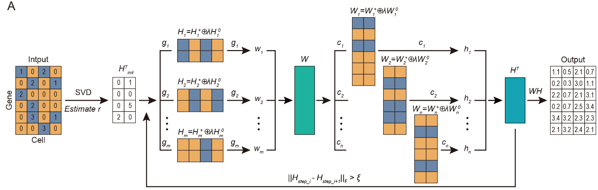
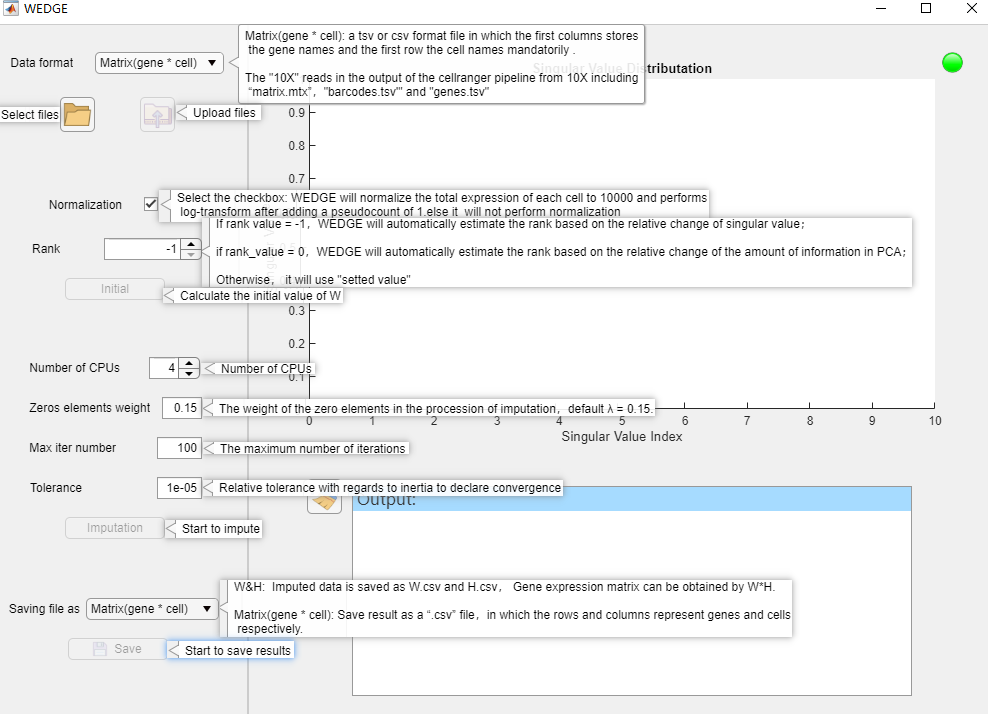

<!-- TOC -->
- [WEDGE](#wedge)
    - [Installation](#installation)
    - [Tutorial](#tutorial)
        - [Preprocessing](#preprocessing)
        - [Imputation](#imputation)
    - [Help](#help)
<!-- TOC -->


WEDGE
===


WEDGE is a weighted low-rank matrix completion algorithm for recovering  scRNA-seq gene expression data with high dropout rate.

### Installation

If you are familiar with MATLAB, then please skip this section and view the [Command-Line Tutorial](#Tutorial). If not, we also provide GUI version below:

| WEDGE Release | Windows    | Linux desktop     | Mac                         |
| ------------- | ------------------------------------------------------------ | ---------- | ------------------------------------------------------------ |
| Version_1.0.1 | [64-bit](http://galaxy.ustc.edu.cn:30803/liunianping/WEDGE/WEDGE_windows_1.0.1.exe) | [64-bit](http://galaxy.ustc.edu.cn:30803/liunianping/WEDGE/WEDGE_linux_1.0.1.zip) | [64-bit](http://galaxy.ustc.edu.cn:30803/liunianping/WEDGE/WEDGE_MacOS_1.0.1.zip) |

- Windows & Mac: Double-click the installer to start installing WEDGE and select the default options for each step.

- Linux: If you have version 9.6 of the MATLAB Runtime installed in /mathworks/home/application/v96,run the shell script as:

  ```bash
     ./run_WEDGE.sh /mathworks/home/application/v96
  ```

  If you have MATLAB installed in /mathworks/devel/application/matlab, run the shell script as:

  ```bash
     ./run_WEDGE.sh /mathworks/devel/application/matlab-MCRInstaller.zip
  ```


> Note: If you want to use WEDGE in Linux without desktop, please use MATLAB source code of WEDGE and view [Tutorial](#Tutorial).
APP Interface:

<div align=center>

</div>


> Note: The [MATLAB Runtime](https://ww2.mathworks.cn/products/compiler/matlab-runtime.html) is need for WEDGE，and R2019a and later versions are suitable. You can install MATLAB Runtime before installing WEDGE or install it automatically during the installation of WEDGE. 
>
> | Release (MATLAB Runtime Version) | Windows                                                      | Linux                                                        | Mac                                                          |
> | :------------------------------- | :----------------------------------------------------------- | :----------------------------------------------------------- | :----------------------------------------------------------- |
> | R2019b (9.7)                     | [64-bit](http://ssd.mathworks.com/supportfiles/downloads/R2019b/Release/0/deployment_files/installer/complete/win64/MATLAB_Runtime_R2019b_win64.zip) | [64-bit](http://ssd.mathworks.com/supportfiles/downloads/R2019b/Release/0/deployment_files/installer/complete/glnxa64/MATLAB_Runtime_R2019b_glnxa64.zip) | [Intel 64-bit](http://ssd.mathworks.com/supportfiles/downloads/R2019b/Release/0/deployment_files/installer/complete/maci64/MATLAB_Runtime_R2019b_maci64.dmg.zip) |
> | R2019a (9.6)                     | [64-bit](https://ssd.mathworks.com/supportfiles/downloads/R2019a/Release/5/deployment_files/installer/complete/win64/MATLAB_Runtime_R2019a_Update_5_win64.zip) | [64-bit](https://ssd.mathworks.com/supportfiles/downloads/R2019a/Release/5/deployment_files/installer/complete/glnxa64/MATLAB_Runtime_R2019a_Update_5_glnxa64.zip) | [Intel 64-bit](https://ssd.mathworks.com/supportfiles/downloads/R2019a/Release/5/deployment_files/installer/complete/maci64/MATLAB_Runtime_R2019a_Update_5_maci64.dmg.zip) |


### Tutorial

##### Preprocessing

We recomend that user filter unwanted genes and cell before recovering raw data. By default, we normalize the total expression of each cell to 10,000, and perform log-transform after adding a pseudocount of 1. 

> Note: If there is a batch effect in the data, and the batch effect is not caused by dropout, it is recommended that the user remove the batch effect using other software such as [seurat3.0](https://satijalab.org/seurat/).

##### Imputation

`WEDGE_recovery()` is the main function to recovery scRNA-seq data. We provided `main_demo.m` file to introduce how to change the parameters used in WEDGE. Here, You’ll get to know how to use WEDGE.

Initially, Begin by cleaning up the matlab environment:

```matlab
clc;
clear;
close all;
```

Now, you should set the input file,  a `tsv`  or `csv` format file in which the first columns stores the gene names and the first row the cell names  mandatorily；alternatively，the  input file can be a [10x-Genomics-formatted](https://support.10xgenomics.com/single-cell-gene-expression/software/pipelines/latest/what-is-cell-ranger) mtx directory.

```matlab
input_path= './Data/Baron.csv'; %the dir of input file;
```

> Attention: 
>
> 1. apostrophe `''` is a must for `input_path` parameter due to internal implemention.
> 2. If input file is 10x-Genomics-formatted mtx directory, `input_path` must end with `/`, for example input_path= './Data/amount<font color='red'>**/**</font>'


Then, some **optional paramaters** can be set as below:

``` matlab
output_format =[]; %the saver format of recovery data.
%there are two options, 'W_H' and []
%if you set output_format = 'W_H', the output is W and H, the recovery data is equal to W*H;
%the default is output_format =[]; save recovery data as WEDGE_recovery.csv, rows is genes and columns is cells.

output_path =''; %the dir of output file, for example './res/'. 
%default output_path =[]; In this time if output_format = 'W_H', then output_path ='./res/'; otherwise, output_path ='./';

normalization = 1; 
%if normalization = 0, WEDGE do not normalize data.
%default, normalization = 1, WEDGE normalizes the total expression of each cell to 10,000 and performs log-transform after adding a pseudocount of 1. 


options.n_rank = []; 
%A positive integer, the rank of gene expression matrix; if options.n_rank = [], WEDGE will automatically estimate the rank of matrix
%otherwise, WEDGE will use the value set by the user.

options.lambda=[];
%the weights of  Zero elements;
%there are two select for  lambda, default lambda = 0.15 
%1. setting postive number to lambda

options.max_iters=[];% the maximum number of iterations for solving weight low-rank factorization;

options.tol=[]; %the error of object function when iter is convergence;

options.bound =[];%the minimum change value of single values when estimating the rank of gene expression matrix;

options.figure_state=0; %1 plot the change value of single values ; 0 don't plot the change value of single values . default 0;
```

> Attention: `output_path` paramater must comply with the same rule as `input_path` illustrated above

Now, The last thing you have to do is to invoke the `WEDGE_recovery()` function. 

```
[W,H]= WEDGE_recovery(input_path,output_path,output_format,normalization, options);
```

### Help
If you have any questions or require assistance using WEDGED, please contact us: hyl2016@mail.ustc.edu.cn .